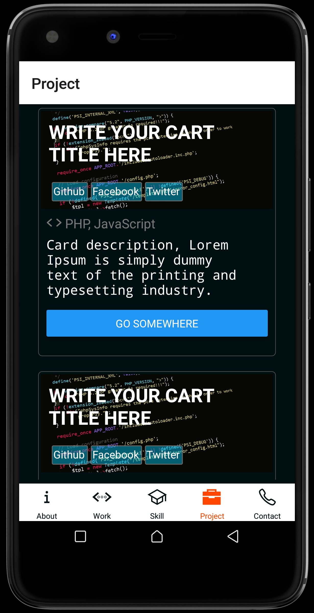

### Dynamic cards for your react native app
## Installation
yarn

```bash
yarn add dynacard
```
npm
```bash
npm i dynacard
```
## Usage
```javascript
import React, { Component } from 'react'
import { SafeAreaView, ScrollView } from 'react-native'
import Dynacard from 'dynacard'
import style from '../Style'

class Project extends Component {
    constructor(props) {
        super(props)
    }

    render() {
       
        let links = [{
                name: "Github",
                link: "https://github.com/nigatedev/abassdev"
            },
            {
                name: "Facebook",
                link: "https://m.facebook.com/abasscheik.ben"
            },
            {
                name: "Twitter",
                link: "https://twitter.com/abasscheik1"
            },
        ]
        return(
            <SafeAreaView style={style.defaultContainer}>
	            <ScrollView showsVerticalScrollIndicator={false}>
                    <Dynacard
                        image={require("../assets/images/php_code.jpg")}
                        title="WRITE YOUR CART TITLE HERE"
                        headLinks={links}
                        lansUsed="PHP, JavaScript"
                        description="Card description, Lorem Ipsum is simply dummy text of the printing and typesetting industry."
                        btnGo={{title: 'Go somewhere', link: 'https://todaydevs.com'}}
                    />
                    <Dynacard
                        image={require("../assets/images/php_code.jpg")}
                        title="WRITE YOUR CART TITLE HERE"
                        headLinks={links}
                        lansUsed="PHP, JavaScript"
                        description="Card description, Lorem Ipsum is simply dummy text of the printing and typesetting industry."
                        btnGo={{title: 'Go somewhere', link: 'https://todaydevs.com'}}
                    />
	            </ScrollView>
	        </SafeAreaView>
        )
    }
}

export default Project
```

## Result


## Contact
If you want to contribute to this famous project or found any bug, please contact us here cheikabassben@gmail.com / abass@todaydevs.com
